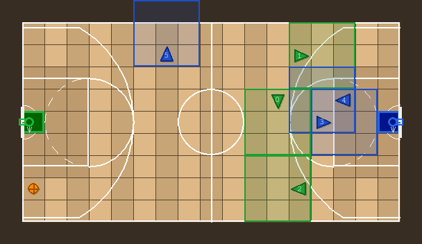

# Basketball 3vs3 Environment

## Overview

A 3-on-3 basketball game environment for multi-agent reinforcement learning research. Teams score by carrying the ball to the opposing team's hoop on the baseline. Built on top of the MOSAIC multigrid engine with the same mechanics as Soccer IndAgObs (teleport passing, steal cooldown, ball respawn, first-to-N-goals termination).

<p align="center">
  
</p>

---

## Registered Environments

| Environment ID | Observation Model | Description |
|----------------|-------------------|-------------|
| `MosaicMultiGrid-Basketball-3vs3-IndAgObs-v0` | Independent agent views | Each agent sees only its 3x3 local window |
| `MosaicMultiGrid-Basketball-3vs3-TeamObs-v0` | Independent + teammate features | 3x3 view + relative teammate positions, directions, has_ball |

Both environments share the same game mechanics. The only difference is what information each agent receives in its observation.

---

## Quick Start

```python
import gymnasium as gym
import mosaic_multigrid.envs

# IndAgObs: independent 3x3 views only
env = gym.make('MosaicMultiGrid-Basketball-3vs3-IndAgObs-v0', render_mode='rgb_array')
obs, info = env.reset(seed=42)

# obs is a dict keyed by agent index: {0: {...}, 1: {...}, ..., 5: {...}}
print(obs[0]['image'].shape)     # (3, 3, 3) -- partial view
print(obs[0]['direction'])       # 0-3 (right/down/left/up)

for step in range(200):
    actions = {i: env.action_space[i].sample() for i in range(6)}
    obs, rewards, terminated, truncated, info = env.step(actions)

    if terminated[0]:  # A team scored 2 goals
        print(f"Game over in {step} steps!")
        break

env.close()
```

```python
# TeamObs: 3x3 views + SMAC-style teammate awareness
env = gym.make('MosaicMultiGrid-Basketball-3vs3-TeamObs-v0', render_mode='rgb_array')
obs, info = env.reset(seed=42)

# Each agent's observation now includes teammate info:
print(obs[0]['image'].shape)              # (3, 3, 3) -- unchanged
print(obs[0]['teammate_positions'])       # (2, 2) relative (dx, dy) to each of 2 teammates
print(obs[0]['teammate_directions'])      # (2,)   direction each teammate faces
print(obs[0]['teammate_has_ball'])        # (2,)   1 if teammate carries ball

env.close()
```

---

## Court Layout

### 17x9 Playable Area (19x11 Total)

<p align="center">
  
</p>


### Dimensions

| Dimension | Value |
|-----------|-------|
| Total grid | 19 x 11 (209 cells) |
| Walls | 56 cells (outer boundary) |
| Goals | 2 cells (fixed positions) |
| Playable | 17 x 9 = 153 cells |
| Aspect ratio | ~1.89:1 (close to NBA court 94ft x 50ft = 1.88:1) |

---

## Teams and Agents

| Team | Index | Color | Side | Agents | Goal (scores HERE) |
|------|-------|-------|------|--------|---------------------|
| Green | 1 | (30, 160, 50) | Left | 0, 1, 2 | G2 at (17, 5) |
| Blue | 2 | (30, 80, 200) | Right | 3, 4, 5 | G1 at (1, 5) |

- `agents_index = [1, 1, 1, 2, 2, 2]` -- 3 agents per team
- Each team defends the goal on their side and scores at the opposite goal
- Agent colors match team: Green triangles vs Blue triangles

---

## Game Mechanics

### Scoring

An agent scores by:
1. Picking up the ball (PICKUP action, face ball and press action 3)
2. Navigating to the opposing team's goal cell
3. Dropping the ball at the goal (DROP action, face goal and press action 4)

When a goal is scored:
- Scoring team receives +1 reward per agent
- Opposing team receives -1 reward per agent (zero-sum)
- Ball respawns at a random empty cell
- Team scores are tracked (first to `goals_to_win` terminates the episode)

### Teleport Passing

The DROP action uses **teleport passing** (identical to Soccer IndAgObs):

```python
# Priority order when an agent presses DROP while carrying the ball:
# 1. Score at goal (if facing an opponent goal cell)
# 2. Teleport pass to a random eligible teammate (anywhere on the grid)
# 3. Drop ball on ground (if forward cell is empty)
```

Teleport passing means the ball instantly transfers to a teammate anywhere on the court. The passer does NOT need to see the receiver. This makes passing a timing decision ("when to pass") rather than a positioning puzzle ("where to stand").

### Stealing

An agent can steal the ball from an opponent by facing them and pressing PICKUP:

```python
# Stealing rules:
# - Must face the opponent (in the forward cell)
# - Opponent must be carrying the ball
# - Stealer must NOT be in cooldown
# - Only works against opponents (cannot steal from teammates)
```

**Dual cooldown**: After a successful steal, BOTH the stealer and victim enter a 10-step cooldown during which neither can steal or be stolen from. This prevents ping-pong stealing.

### Ball Respawn

After each goal, the ball respawns at a random empty cell (seeded by `env.np_random`). This keeps the game flowing continuously.

---

## Episode Termination

| Criterion | Condition |
|-----------|-----------|
| **Terminated** | When any team scores `goals_to_win` goals (default: 2) |
| **Truncated** | When `max_steps` reached (default: 200) |
| **Winner** | First team to reach the goal threshold |

### Configuration

```python
# Default: first to 2 goals, 200 steps max
env = gym.make('MosaicMultiGrid-Basketball-3vs3-IndAgObs-v0')

# Custom: first to 3 goals, 500 steps max
env = gym.make(
    'MosaicMultiGrid-Basketball-3vs3-IndAgObs-v0',
    goals_to_win=3,
    max_steps=500,
)
```

---

## Observation Space

### IndAgObs (Independent Agent Observations)

Each agent receives:

```python
{
    'image': np.ndarray,     # (3, 3, 3) -- [Type, Color, State] per cell
    'direction': int,        # 0=right, 1=down, 2=left, 3=up
    'mission': str,          # "maximize reward"
}
```

The 3x3 image is a **directional** partial view: the agent is at the rear-center of its view, looking forward. The view rotates with the agent's direction:

Coverage: 9 cells out of 153 playable = ~6% of the court. Agents almost never see teammates or opponents in their local window, which makes team coordination a genuine challenge.

### TeamObs (SMAC-style Teammate Awareness)

Adds to each agent's observation:

| Feature | Shape | Description |
|---------|-------|-------------|
| `teammate_positions` | (2, 2) int64 | Relative (dx, dy) from self to each of 2 teammates |
| `teammate_directions` | (2,) int64 | Direction each teammate faces (0-3) |
| `teammate_has_ball` | (2,) int64 | 1 if teammate carries ball, 0 otherwise |

The local 3x3 `image`, `direction`, and `mission` are preserved unchanged. TeamObs only ADDS new keys.

With 3 agents per team, each agent has N=2 teammates.

### Ball Carrying Observability

Agents can see when other agents in their view are carrying the ball, using the STATE channel encoding:

```
STATE channel values for agents:
  0-3:     Direction (right/down/left/up) when NOT carrying ball
  100-103: Direction + ball carrying flag (e.g., 101 = down + has ball)

Decoding:
  has_ball  = (state >= 100)
  direction = state % 100
```

This works because Basketball (like Soccer and Collect) has NO doors, so door state values (0-2) are unused and there is no conflict with the 100+ offset range.

---

## Reward Structure

| Event | Reward | Notes |
|-------|--------|-------|
| Pickup ball from ground | 0 | Neutral |
| Steal ball from opponent | 0 | Neutral |
| Pass ball to teammate | 0 | Neutral |
| Score goal | +1 (team), -1 (opponent) | Zero-sum |
| Episode termination | -- | Natural signal when team wins |

Only scoring gives reward. This creates a clear optimization objective for RL agents.

---

## Basketball Court Rendering

The basketball environment uses a custom pygame-based renderer (`rendering/basketball.py`) instead of the default tile-based grid rendering.

### Visual Elements

| Layer | Description |
|-------|-------------|
| Hardwood floor | Alternating vertical plank strips (light/dark) |
| Paint area | Shaded key areas near each basket (3 tiles deep, 5 tiles tall) |
| Court markings | White lines: boundary, center line, center circle, three-point arcs, free-throw semicircles, restricted area arcs, paint rectangles |
| Goal cells | Team-colored tiles on the baseline with colored border |
| Baskets | Backboard + team-colored hoop + rim + connector + net lines |
| Agent FOV | Semi-transparent team-colored overlay showing each agent's 3x3 directional view |
| Agents | Team-colored triangles pointing in facing direction, with ball indicator glow when carrying |
| Ball | Orange circle with cross-seam lines (basketball appearance) |
| Labels | Small white agent ID numbers |

### Court Configuration

```python
court_cfg = {
    'paint_depth': 3,        # Paint area extends 3 tiles from baseline
    'paint_half_h': 2,       # Paint area half-height (5 tiles total: cy-2 to cy+2)
    'three_pt_radius': 5.0,  # Three-point arc radius in tiles
    'center_radius': 1.5,    # Center circle radius in tiles
    'ft_circle_radius': 2,   # Free-throw semicircle radius in tiles
}
```

### Render Output

```python
env = gym.make('MosaicMultiGrid-Basketball-3vs3-IndAgObs-v0', render_mode='rgb_array')
obs, info = env.reset(seed=42)
frame = env.render()
# frame.shape = (352, 608, 3)  -- uint8 RGB at 32px per tile
# height = 11 * 32 = 352, width = 19 * 32 = 608
```

---

## Comparison with Soccer

| Aspect | Soccer (2v2) | Basketball (3vs3) |
|--------|-------------|------------------|
| Grid size | 16 x 11 (14x9 playable) | 19 x 11 (17x9 playable) |
| Teams | 2v2 (4 agents) | 3vs3 (6 agents) |
| Team colors | Green vs Red | Green vs Blue |
| Goal positions | (1, 5) and (14, 5) | (1, 5) and (17, 5) |
| Aspect ratio | 1.56:1 (FIFA) | 1.89:1 (NBA) |
| Rendering | FIFA field (grass, lines) | Basketball court (hardwood, arcs, hoops) |
| Teleport passing | Yes | Yes |
| Steal cooldown | 10 steps (dual) | 10 steps (dual) |
| Ball respawn | Yes | Yes |
| Goals to win | 2 | 2 |
| Max steps | 200 | 200 |
| Zero-sum | Yes | Yes |
| Observation (IndAgObs) | 3x3 local view | 3x3 local view |
| TeamObs teammates | N=1 (1 teammate in 2v2) | N=2 (2 teammates in 3vs3) |

### Key Difference: Team Size

Basketball has 3 agents per team instead of 2. This creates:
- More complex coordination (3 agents to synchronize, not 2)
- Richer passing networks (2 possible pass targets vs 1)
- More defensive coverage needed (3 opponents to track)
- Higher-dimensional action space (6 agents total vs 4)

---


## Action Space

7 discrete actions per agent (same as all MOSAIC environments):

| Action | Index | Description |
|--------|-------|-------------|
| Turn left | 0 | Rotate 90 degrees counterclockwise |
| Turn right | 1 | Rotate 90 degrees clockwise |
| Move forward | 2 | Move one cell in facing direction |
| Pickup | 3 | Pick up ball from ground, or steal from opponent |
| Drop | 4 | Score at goal / teleport pass / drop on ground |
| Toggle | 5 | Unused in basketball |
| Done | 6 | No-op (skip turn) |

Total action space: `Dict(0: Discrete(7), ..., 5: Discrete(7))` -- one entry per agent.

---

## PettingZoo Integration

Basketball environments work with both PettingZoo APIs:

```python
from mosaic_multigrid.envs import BasketballGame6HIndAgObsEnv19x11N3
from mosaic_multigrid.pettingzoo import to_pettingzoo_env, to_pettingzoo_aec_env

# Parallel API (simultaneous stepping)
PZParallel = to_pettingzoo_env(BasketballGame6HIndAgObsEnv19x11N3)
env = PZParallel(render_mode='rgb_array')

# AEC API (sequential turn-based)
PZAec = to_pettingzoo_aec_env(BasketballGame6HIndAgObsEnv19x11N3)
env = PZAec(render_mode='rgb_array')
```

---

## Expected RL Training Dynamics

### Phase 1: Random Exploration (0-100k episodes)
- Agents discover movement, pickup, and drop actions
- Accidental goals from random walks
- No coordination

### Phase 2: Ball Seeking (100k-300k episodes)
- Learn to pick up the ball
- Learn to move toward goals
- Solo play, no passing

### Phase 3: Scoring + Stealing (300k-700k episodes)
- Consistent scoring when finding the ball
- Discover stealing mechanic
- Basic defensive positioning

### Phase 4: Passing + Role Specialization (700k-1.5M episodes)
- Learn to pass to open teammates (especially with TeamObs)
- Offensive/defensive role emergence
- 2-on-1 fast break plays
- Defensive rotation

### Phase 5: Advanced Team Play (1.5M+ episodes)
- Pick-and-roll style coordination
- Dynamic role switching
- Outlet passing after steals
- Zone defense vs man-to-man defense emergence

The 3vs3 format creates richer emergent behaviors than 2v2 Soccer because:
- Passing has 2 targets (tactical choice, not forced)
- Defense requires 3 agents to cover 3 opponents
- Off-ball movement becomes meaningful (creating space for teammates)
