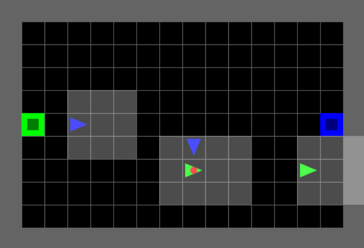
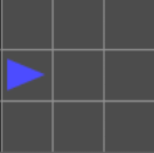
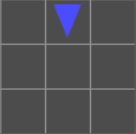
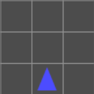

# mosaic_multigrid

**Research-grade multi-agent gridworld environments for reproducible RL experiments.**

A maintained fork of [gym-multigrid](https://github.com/ArnaudFickinger/gym-multigrid) by Arnaud Fickinger (2020), modernized to the Gymnasium API with Numba JIT-accelerated observations, reproducible seeding, and multi-agent framework adapters.

This fork is developed as part of the [MOSAIC](https://github.com/Abdulhamid97Mousa/MOSAIC) project (Multi-Agent Orchestration System).

## Design Philosophy: Best of Both Worlds

**mosaic_multigrid = gym-multigrid game design + INI multigrid modern infrastructure**

We kept the **challenging partial observability** (`view_size=3`) that makes Soccer/Collect interesting for competitive multi-agent research, while adopting **modern API and optimizations** from INI multigrid standards.

### What We Kept from gym-multigrid (Fickinger 2020)

1. **Partial observability** - `view_size=3` for Soccer/Collect (challenging team coordination)
2. **Game mechanics** - Ball passing, stealing, scoring, team rewards
3. **Research continuity** - Comparable with original papers

### What We Adopted from INI multigrid (2022+)
1. **Gymnasium 1.0+ API** - Modern 5-tuple dict-keyed observations
2. **3-channel encoding** - `[type, color, state]` format (not 6-channel)
3. **Agent class design** - Separate from WorldObj, cleaner architecture
4. **pygame rendering** - Modern window system (not matplotlib)
5. **Modular structure** - ~20 focused modules (not 1442-line monolith)

### What We Built (Our Contributions)

1. **Reproducibility fix** - Fixed critical global RNG bug
2. **Numba JIT optimization** - 10-100× faster observation generation
3. **Comprehensive tests** - 130 tests covering all functionality
4. **Framework adapters** - RLlib, PettingZoo integration
5. **Observation wrappers** - FullyObs, ImgObs, OneHot, SingleAgent
---

## What Changed from Upstream: The Full Story

Showing how we combined the best of both packages:

| Aspect | gym-multigrid (Fickinger 2020) | INI multigrid (Oguntola 2023) | **mosaic_multigrid (This Fork)** |
|--------|-------------------------------|-------------------------------|----------------------------------|
| **API** | Old Gym 4-tuple, list-based | Gymnasium 5-tuple, dict-keyed |  **Gymnasium 5-tuple, dict-keyed** (from INI) |
| **Actions** | 8 (still=0..done=7) | 7 (left=0..done=6) |  **7 actions, no "still"** (from INI) |
| **Observations** | `(3, 3, 6)` dict (Soccer) | `(7, 7, 3)` dict (default) |  **`(3, 3, 3)` dict** (Soccer) |
| **Encoding** | 6 channels | 3 channels [type, color, state] |  **3 channels** (from INI) |
| **view_size** | **3** (Soccer/Collect) | **7** (default) |  **3 (KEPT from gym-multigrid)** for competitive challenge |
| **Game Logic** | **Soccer, Collect, team rewards** | Exploration tasks (no team games) |  **Soccer, Collect** (from gym-multigrid) |
| **`reset()`** | `List[obs]` | `(Dict[obs], Dict[info])` |  **`(Dict[obs], Dict[info])`** (from INI) |
| **`step()`** | `(List[obs], ndarray, bool, dict)` | `(Dict, Dict, Dict, Dict, Dict)` |  **5-tuple per-agent dicts** (from INI) |
| **Render** | `render(mode='human')` param | `render_mode` constructor param |  **`render_mode` constructor** (from INI) |
| **Seeding** | `env.seed(42)` + **broken global RNG** | `reset(seed=42)` + `self.np_random` |  **Fixed seeding** (from INI) + **bug fix** (ours) |
| **Window** | matplotlib | pygame |  **pygame** (from INI) |
| **Performance** | Pure Python loops | Pure Python |  **Numba JIT** (ours, 10-100× faster) |
| **Structure** | 1442-line monolith | Modular package |  **~20 focused modules** (from INI) |
| **Dependencies** | `gym>=0.9.6, numpy` | `gymnasium, numpy, pygame` |  **+ numba, aenum** (optimizations) |
| **Tests** | Basic test script | Unknown |  **130 comprehensive tests** (ours) |
| **Use Case** | Multi-agent team research | Single-agent exploration |  **Multi-agent competitive** with modern API |

**Observation Space Notation**: The format is `(height, width, channels)` where:

- **gym-multigrid**: `(3, 3, 6)` = 3×3 grid with 6-channel encoding for Soccer/Collect
- **INI multigrid**: `(7, 7, 3)` = 7×7 grid with 3-channel [type, color, state] encoding (default)
- **mosaic_multigrid**: `(3, 3, 3)` = 3×3 grid (kept from gym-multigrid) + 3-channel encoding (from INI)

**Legend**:


-  = What we adopted/built
- Items from gym-multigrid: view_size=3, Soccer/Collect game mechanics
- Items from INI multigrid: Gymnasium API, 3-channel encoding, pygame, modular structure
- Our contributions: Reproducibility fix, Numba JIT, comprehensive tests, framework adapters

### Bugs Fixed

1. **Reproducibility bug** (critical): `step()` used `np.random.permutation()` (global RNG) for action ordering. Now uses `self.np_random.random(size=N).argsort()` to respect environment seeding.
2. **No `render_mode`**: Constructor now accepts `render_mode='rgb_array'` or `render_mode='human'`, following Gymnasium convention.
3. **Legacy 4-tuple**: `step()` returns Gymnasium 5-tuple `(obs, rewards, terminated, truncated, info)` with per-agent dicts.

## Included Environments

### SoccerGame (Enhanced — Recommended)

<p align="center">
  
</p>

Team-based competitive environment. Agents score by dropping the ball at the opposing team's goal. Features **teleport passing**, stealing with dual cooldown, ball respawn, and first-to-2-goals termination.

**Recommended variant:** `SoccerGame4HEnhancedEnv16x11N2` — 4 agents (2v2), 16×11 grid (FIFA ratio), 1 ball, zero-sum.

### CollectGame (Individual Competition)

<p align="center">
  
</p>

Individual competitive collection. 3 agents compete individually to collect the most balls.

**Default variant:** `CollectGame3HEnv10x10N3` — 3 agents, 10×10 grid, 5 wildcard balls, zero-sum.  
**Enhanced variant:** `CollectGame3HEnhancedEnv10x10N3` — Natural termination when all balls collected (35× faster).

### Collect2vs2Game (Team-Based Collection)

<p align="center">
  
</p>

Team-based competitive collection. 4 agents in 2 teams (2v2) compete to collect the most balls. Similar to Soccer but without goals — agents earn points directly by picking up balls. **7 balls ensures no draws!**

**Default variant:** `CollectGame4HEnv10x10N2` — 4 agents (2v2), 10×10 grid, 7 wildcard balls.

---

## Enhanced Environments (v1.1.0)

**IMPORTANT:** We've fixed critical bugs in Soccer and Collect environments! The original environments are kept for backward compatibility, but **Enhanced variants are RECOMMENDED for all new RL research.**

### What's New?

| Environment | Status | Key Improvements |
|------------|--------|-----------------|
| **MosaicMultiGrid-Soccer-Enhanced-v0** | ✅ Recommended | Ball respawns after goals, first-to-2-goals termination, dual cooldown on stealing, 16×11 FIFA aspect ratio, 50× faster training |
| **MosaicMultiGrid-Collect-Enhanced-v0** | ✅ Recommended | Natural termination when all balls collected, 35× faster training (300 vs 10,000 steps) |
| **MosaicMultiGrid-Collect2vs2-Enhanced-v0** | ✅ Recommended | Natural termination, 7 balls (odd number prevents draws), team coordination |
| MosaicMultiGrid-Soccer-v0 | ⚠️ Deprecated | Ball disappears after scoring, no termination, runs 10,000 steps always |
| MosaicMultiGrid-Collect-v0 | ⚠️ Deprecated | No termination after all balls collected, wastes computation |

### Critical Bugs Fixed

**Soccer Environment:**
- ❌ **Bug**: Ball disappears after scoring and never respawns → ✅ **Fixed**: Ball respawns at random location
- ❌ **Bug**: No natural termination (always runs 10,000 steps) → ✅ **Fixed**: First team to 2 goals wins
- ❌ **Bug**: Agents can't see who is carrying ball → ✅ **Fixed**: STATE channel encoding + visual overlay
- ❌ **Bug**: Infinite stealing exploit (no cooldown) → ✅ **Fixed**: 10-step dual cooldown for both stealer and victim

**Collect Environment:**
- ❌ **Bug**: No termination when all balls collected (wastes 95% of computation) → ✅ **Fixed**: Natural termination when done
- ✅ **Result**: **35× faster training** (300 vs 10,000 steps per episode)

### Documentation

- **[SOCCER_IMPROVEMENTS.md](SOCCER_IMPROVEMENTS.md)** — Complete Soccer bug analysis, fixes, mechanics (passing, stealing, cooldown), map layout, training timeline
- **[COLLECT_IMPROVEMENTS.md](COLLECT_IMPROVEMENTS.md)** — Collect bug fix, 35× speedup analysis, training efficiency comparison

### Quick Start with Enhanced Environments

```python
import gymnasium as gym

# Soccer Enhanced: 2v2, FIFA aspect ratio, first to 2 goals wins
env = gym.make('MosaicMultiGrid-Soccer-Enhanced-v0', render_mode='rgb_array')

# Collect Enhanced (Individual): 3 agents, terminates when all 5 balls collected
env = gym.make('MosaicMultiGrid-Collect-Enhanced-v0', render_mode='rgb_array')

# Collect Enhanced (2v2): 4 agents, 7 balls (odd = no draws)
env = gym.make('MosaicMultiGrid-Collect2vs2-Enhanced-v0', render_mode='rgb_array')

obs, info = env.reset(seed=42)

for step in range(500):  # Much shorter episodes!
    actions = {i: policy(obs[i]) for i in range(env.num_agents)}
    obs, rewards, terminated, truncated, info = env.step(actions)

    if terminated[0]:  # ✅ Natural termination!
        print(f"Episode finished in {step} steps")
        break

env.close()
```

---

## Installation

### From PyPI (recommended)

```bash
pip install mosaic-multigrid

# With optional framework adapters
pip install mosaic-multigrid[rllib]       # Ray RLlib support
pip install mosaic-multigrid[pettingzoo]  # PettingZoo support
pip install mosaic-multigrid[dev]         # pytest
```

### From source

```bash
git clone https://github.com/Abdulhamid97Mousa/mosaic_multigrid.git
cd mosaic_multigrid
pip install -e .
```

## Quick Start

### Recommended: Enhanced Environments (v1.1.0)

```python
import gymnasium as gym

# ✅ Soccer Enhanced: Ball respawns, first to 2 goals, 200 steps max
env = gym.make('MosaicMultiGrid-Soccer-Enhanced-v0', render_mode='rgb_array')

# ✅ Collect Enhanced (Individual): Terminates when all 5 balls collected
env = gym.make('MosaicMultiGrid-Collect-Enhanced-v0', render_mode='rgb_array')

# ✅ Collect Enhanced (2v2): Terminates when all 7 balls collected
env = gym.make('MosaicMultiGrid-Collect2vs2-Enhanced-v0', render_mode='rgb_array')

obs, info = env.reset(seed=42)

# obs is a dict keyed by agent index: {0: {...}, 1: {...}, ...}
# Each agent's obs has 'image', 'direction', 'mission' keys
print(obs[0]['image'].shape)  # (3, 3, 3) - partial view!

for step in range(500):
    actions = {i: env.action_space[i].sample() for i in range(env.num_agents)}
    obs, rewards, terminated, truncated, info = env.step(actions)

    # Enhanced environments terminate naturally!
    if terminated[0]:
        print(f"✅ Episode finished in {step} steps (natural termination)")
        break

# Render RGB frame
frame = env.render()  # Returns numpy array (H, W, 3)
env.close()
```

### Original Environments (Backward Compatibility)

```python
# ⚠️ Original Soccer: Ball disappears, no termination (10,000 steps always)
env = gym.make('MosaicMultiGrid-Soccer-v0', render_mode='rgb_array')

# ⚠️ Original Collect: No termination after balls collected (10,000 steps always)
env = gym.make('MosaicMultiGrid-Collect-v0', render_mode='rgb_array')
```

## Partial Observability

**Agents have limited field of view!** We use **view_size=3** (from gym-multigrid) for competitive team games. This creates challenging coordination problems where agents can't see the entire field.

### Why view_size=3?

We **kept the small view size from gym-multigrid** for research continuity:
-  **Challenging** - Forces team coordination and communication
-  **Realistic** - Agents can't see everything (fog of war)
-  **Research proven** - Comparable with Fickinger et al. (2020)

We **adopted modern infrastructure from INI multigrid**:
-  Gymnasium API, 3-channel encoding, pygame rendering, Numba JIT

### Visual Comparison

#### Agent View Size

Each agent has **limited perception** - they only see a local grid around them, not the entire environment.

#### Default View: 3×3 (mosaic_multigrid — Competitive)

<p align="center">
  
</p>

Each agent sees only a **3×3 local window** around itself. Coverage: 9 cells. Forward: 2 tiles. Sides: 1 tile each.  
⚠️ With `view_size=3`, agents typically **cannot** see the ball, goals, or teammates — forcing team coordination strategies.

#### View Rotation

**The view rotates with the agent!** The agent is always at the bottom-center, facing "up" in its own reference frame.

<p align="center">
  
  
</p>
<p align="center">
  
  
</p>

### Configurable View Size

```python
from mosaic_multigrid.envs import SoccerGameEnv

# Default: 3×3 (competitive challenge)
env = SoccerGameEnv(view_size=3, ...)
obs, _ = env.reset()
print(obs[0]['image'].shape)  # (3, 3, 3)

# Match INI multigrid: 7×7 (easier)
env = SoccerGameEnv(view_size=7, ...)
obs, _ = env.reset()
print(obs[0]['image'].shape)  # (7, 7, 3)
```

### Observation Format (Enhanced Multi-Agent Encoding)

- `obs[agent_id]['image']` shape: `(view_size, view_size, 3)`
  - **Channel 0: Object TYPE** (wall, ball, goal, agent, etc.)
  - **Channel 1: Object COLOR** (red, blue, green team colors, etc.)
  - **Channel 2: Object STATE** - Context-dependent encoding:
    - **For doors**: 0=open, 1=closed, 2=locked (standard MiniGrid)
    - **For agents**: 0-3 OR 100-103
      - `0-3`: Agent direction (right/down/left/up) when **NOT carrying ball**
      - `100-103`: Agent direction **+ ball carrying flag** (e.g., 101 = down + has ball)
    - **For other objects**: 0 (unused)
- `obs[agent_id]['direction']`: int (0=right, 1=down, 2=left, 3=up)
- `obs[agent_id]['mission']`: Mission string

**The agent is always at the bottom-center of its view**, looking forward. The view rotates with the agent's direction.

#### 🎯 Ball Carrying Observability Enhancement

**Key Feature**: Agents can now see when **other agents are carrying the ball**!

This solves a critical observability limitation in the original 3-channel encoding:

```python
# Example: Red agent observing Green agent with ball
obs[red_agent]['image'][1, 0, :] = [Type.agent, Color.green, 101]
#                                                              ↑
#                                    STATE=101 means: facing DOWN + HAS BALL!

# Decoding:
has_ball = (state >= 100)      # True
direction = state % 100         # 1 (down)
```

**Why this works**:
- Soccer and Collect have **NO doors** (door states 0-2 are unused)
- We repurpose the unused STATE channel space with offset 100
- No conflicts: door states (0-2), agent direction (0-3), agent+ball (100-103) are all separate
- **Zero memory overhead** - still 3 channels, still uint8 values

**Before this fix**:
- ❌ Agents could NOT see if others had the ball
- ❌ Required memory architectures (LSTM) to track ball possession
- ❌ Made stealing/defense strategies nearly impossible

**After this fix**:
- ✅ Agents CAN see who has the ball in their view
- ✅ Enables reactive defense strategies without memory
- ✅ Faster training, better decision-making

📖 **See [PARTIAL_OBSERVABILITY.md](PARTIAL_OBSERVABILITY.md) for detailed visual diagrams and comparison with INI multigrid.**

### Reproducibility

```python
# Same seed → identical trajectories (reproducibility bug is fixed)
for trial in range(2):
    env = SoccerGame4HEnv10x15N2(render_mode='rgb_array')
    obs, _ = env.reset(seed=42)
    for step in range(100):
        actions = {i: 2 for i in range(4)}  # all forward
        obs, *_ = env.step(actions)
    # obs will be identical across trials
```

## Episode Termination & Truncation

Understanding when and how episodes end is crucial for training RL agents. Following the Gymnasium API standard, MOSAIC multigrid distinguishes between **terminated** (natural end condition achieved) and **truncated** (time limit reached).

### Terminology

- **Terminated**: Episode ends naturally when the goal/objective is achieved (e.g., reaching a goal cell, achieving a win condition)
- **Truncated**: Episode ends due to reaching the maximum step limit without achieving the objective
- **max_steps**: Maximum number of environment steps before truncation (default: 10,000 for all MOSAIC games)

### Environment-Specific Criteria

#### Soccer Enhanced (MosaicMultiGrid-Soccer-Enhanced-v0) ✅ RECOMMENDED

| Criterion | Condition |
|-----------|-----------|
| **Terminated** | ✅ When any team scores 2 goals (first-to-win) |
| **Truncated** | ✅ When `max_steps >= 200` (configurable) |
| **Winning Condition** | First team to score `goals_to_win` (default: 2) wins |
| **Scoring Mechanism** | Drop ball at opponent's ObjectGoal: +1 to scoring team, -1 to other team (zero-sum) |
| **Ball Respawn** | ✅ Ball respawns at random location after each goal |
| **Episode Length** | Variable (terminates when team wins, or truncates at 200 steps) |
| **Cooldown** | ✅ 10-step dual cooldown on stealing (both stealer and victim) |

**Design rationale**: Enhanced Soccer provides **natural termination** when a team wins, significantly reducing training time (~50× faster). Ball respawns after each goal to keep gameplay continuous.

```python
env = gym.make('MosaicMultiGrid-Soccer-Enhanced-v0')
obs, _ = env.reset(seed=42)

for step in range(200):
    actions = {i: agent_policy(obs[i]) for i in range(4)}
    obs, rewards, terminated, truncated, info = env.step(actions)

    if terminated[0]:  # ✅ Team scored 2 goals!
        # Determine winner from final rewards
        team1_total = sum(rewards[i] for i in [0, 1])
        team2_total = sum(rewards[i] for i in [2, 3])
        winner = "Team 1 (Green)" if team1_total > 0 else "Team 2 (Red)"
        print(f"🏆 {winner} wins! Episode finished in {step} steps")
        break

    if truncated[0]:  # Time limit reached
        print(f"⏱️ Time limit reached. Determine winner by cumulative score.")
        break
```

📖 **See [SOCCER_IMPROVEMENTS.md](SOCCER_IMPROVEMENTS.md) for complete details on mechanics, bug fixes, and training.**

---

#### Soccer Original (MosaicMultiGrid-Soccer-v0) ⚠️ DEPRECATED

| Criterion | Condition |
|-----------|-----------|
| **Terminated** | ❌ NEVER - No natural termination |
| **Truncated** | ✅ When `max_steps = 10,000` |
| **Winning Condition** | Team with higher cumulative score when truncation occurs |
| **Scoring Mechanism** | Drop ball at opponent's ObjectGoal: +1 to scoring team, -1 to other team (zero-sum) |
| **Episode Length** | Always exactly 10,000 steps (fixed-length competitive game) |

**Design rationale**: Soccer deliberately uses only truncation (no termination) to create **fixed-length competitive matches**. Winner is determined by final score, not by first-to-goal. This mirrors real sports where games have fixed time limits.

```python
env = gym.make('MosaicMultiGrid-Soccer-v0')
obs, _ = env.reset(seed=42)
cumulative_rewards = {i: 0 for i in range(4)}

for step in range(10000):
    actions = {i: agent_policy(obs[i]) for i in range(4)}
    obs, rewards, terminated, truncated, info = env.step(actions)

    for i in range(4):
        cumulative_rewards[i] += rewards[i]

    # terminated[i] is always False (no natural termination)
    # truncated[i] becomes True at step 10,000
    if truncated[0]:  # All agents truncate simultaneously
        # Determine winner: sum rewards by team
        team1_score = cumulative_rewards[0] + cumulative_rewards[1]  # agents 0,1
        team2_score = cumulative_rewards[2] + cumulative_rewards[3]  # agents 2,3
        winner = "Team 1" if team1_score > team2_score else "Team 2"
        print(f"Game Over! Winner: {winner}")
        break
```

---

#### Collect Enhanced (MosaicMultiGrid-Collect-Enhanced-v0) ✅ RECOMMENDED

| Criterion | Condition |
|-----------|-----------|
| **Terminated** | ✅ When all 5 balls are collected |
| **Truncated** | ✅ When `max_steps = 300` (configurable) |
| **Winning Condition** | Agent with highest cumulative reward when episode ends |
| **Scoring Mechanism** | Pickup wildcard ball (index=0): +1 to agent, -1 to all other agents (zero-sum) |
| **Episode Length** | Variable (100-300 steps typically, terminates when all balls collected) |
| **Training Speedup** | ✅ **35× faster** than original (300 vs 10,000 steps) |

**Design rationale**: Enhanced Collect terminates naturally when all balls are collected, eliminating the bug where episodes ran for 10,000 steps with nothing to do. This creates a **35× training speedup** and provides clear termination signals for RL agents.

```python
env = gym.make('MosaicMultiGrid-Collect-Enhanced-v0')
obs, _ = env.reset(seed=42)
cumulative_rewards = {i: 0 for i in range(3)}

for step in range(300):
    actions = {i: agent_policy(obs[i]) for i in range(3)}
    obs, rewards, terminated, truncated, info = env.step(actions)

    for i in range(3):
        cumulative_rewards[i] += rewards[i]

    if terminated[0]:  # ✅ All 5 balls collected!
        winner = max(cumulative_rewards, key=cumulative_rewards.get)
        print(f"🏆 Agent {winner} wins! Episode finished in {step} steps")
        print(f"Final scores: {cumulative_rewards}")
        break
```

📖 **See [COLLECT_IMPROVEMENTS.md](COLLECT_IMPROVEMENTS.md) for complete details on the bug fix and 35× speedup.**

---

#### Collect Enhanced 2vs2 (MosaicMultiGrid-Collect2vs2-Enhanced-v0) ✅ RECOMMENDED

| Criterion | Condition |
|-----------|-----------|
| **Terminated** | ✅ When all 7 balls are collected |
| **Truncated** | ✅ When `max_steps = 400` (configurable) |
| **Winning Condition** | Team with highest cumulative score when episode ends |
| **Scoring Mechanism** | Pickup wildcard ball: +1 to entire team, -1 to opponent team (zero-sum) |
| **Episode Length** | Variable (150-400 steps typically) |
| **Ball Count** | 7 balls (ODD number prevents draws!) |
| **Team Assignment** | agents_index=[1, 1, 2, 2] → Team 1 (agents 0,1) vs Team 2 (agents 2,3) |

```python
env = gym.make('MosaicMultiGrid-Collect2vs2-Enhanced-v0')
obs, _ = env.reset(seed=42)

for step in range(400):
    actions = {i: agent_policy(obs[i]) for i in range(4)}
    obs, rewards, terminated, truncated, info = env.step(actions)

    if terminated[0]:  # ✅ All 7 balls collected!
        team1_score = sum(rewards[i] for i in [0, 1])
        team2_score = sum(rewards[i] for i in [2, 3])
        winner = "Team 1 (Green)" if team1_score > team2_score else "Team 2 (Red)"
        print(f"🏆 {winner} wins!")
        break
```

---

#### CollectGame Original (MosaicMultiGrid-Collect-v0) ⚠️ DEPRECATED

| Criterion | Condition |
|-----------|-----------|
| **Terminated** | ❌ NEVER - No natural termination |
| **Truncated** | ✅ When `max_steps = 10,000` |
| **Winning Condition** | Agent with highest cumulative reward when truncation occurs |
| **Scoring Mechanism** | Pickup wildcard ball (index=0): +1 to agent, -1 to all other agents (zero-sum) |
| **Episode Length** | Always exactly 10,000 steps |
| **Ball Consumption** | 5 wildcard balls total - episode continues even after all balls collected |

**Design rationale**: Individual competition with zero-sum rewards creates a competitive environment where one agent's gain is another's loss. Episodes run for fixed duration regardless of ball availability.

```python
env = gym.make('MosaicMultiGrid-Collect-v0')
obs, _ = env.reset(seed=42)
cumulative_rewards = {i: 0 for i in range(3)}
balls_collected = {i: 0 for i in range(3)}

for step in range(10000):
    actions = {i: agent_policy(obs[i]) for i in range(3)}
    obs, rewards, terminated, truncated, info = env.step(actions)

    for i in range(3):
        cumulative_rewards[i] += rewards[i]
        if rewards[i] > 0:  # Ball collected
            balls_collected[i] += 1

    # Even after all 5 balls collected, episode continues until step 10,000
    if truncated[0]:
        winner = max(cumulative_rewards, key=cumulative_rewards.get)
        print(f"Winner: Agent {winner}")
        print(f"Balls collected: {balls_collected}")
        print(f"Final scores: {cumulative_rewards}")
        break
```

#### Collect2vs2Game (MosaicMultiGrid-Collect2vs2-v0) - 4 Agents, Team Competition

| Criterion | Condition |
|-----------|-----------|
| **Terminated** | ❌ NEVER - No natural termination |
| **Truncated** | ✅ When `max_steps = 10,000` |
| **Winning Condition** | Team with higher cumulative score when truncation occurs |
| **Scoring Mechanism** | Pickup wildcard ball (index=0): +1 to team, -1 to other team (zero-sum) |
| **Episode Length** | Always exactly 10,000 steps |
| **Ball Consumption** | 7 wildcard balls (ODD number prevents draws!) - episode continues after collection |
| **Team Assignment** | agents_index=[1, 1, 2, 2] → Team 1 (agents 0,1) vs Team 2 (agents 2,3) |

**Design rationale**: Using 7 balls (odd number) mathematically guarantees no draws (one team must collect ≥4, other ≤3). Fixed-length episodes with team-based zero-sum rewards create strategic team coordination challenges.

```python
env = gym.make('MosaicMultiGrid-Collect2vs2-v0')
obs, _ = env.reset(seed=42)
cumulative_rewards = {i: 0 for i in range(4)}

for step in range(10000):
    actions = {i: agent_policy(obs[i]) for i in range(4)}
    obs, rewards, terminated, truncated, info = env.step(actions)

    for i in range(4):
        cumulative_rewards[i] += rewards[i]

    if truncated[0]:
        team1_score = cumulative_rewards[0] + cumulative_rewards[1]
        team2_score = cumulative_rewards[2] + cumulative_rewards[3]
        # With 7 balls and zero-sum, scores are guaranteed to differ
        winner = "Team 1 (Green)" if team1_score > team2_score else "Team 2 (Red)"
        print(f"Winner: {winner}")
        print(f"Team 1 collected: {int(team1_score)} balls")
        print(f"Team 2 collected: {int(-team2_score)} balls")  # Negative due to zero-sum
        break
```

### Comparison with MiniGrid

**MiniGrid** environments typically use **both termination and truncation**:
- **Terminated**: When agent reaches the green goal square (`step_on_goal = True`)
- **Truncated**: When `max_steps` reached (default varies: 100-1000 steps)
- **Episode length**: Variable (ends as soon as goal is reached)

**MOSAIC multigrid** uses a different design philosophy:
- **Terminated**: NEVER used in competitive games
- **Truncated**: ALWAYS at `max_steps = 10,000`
- **Episode length**: Fixed (always runs full duration)
- **Rationale**: Competitive team games need fixed time limits where winner is determined by score, not by "first to finish"

### Implementation Details (base.py)

```python
def step(self, actions):
    self.step_count += 1
    rewards = self.handle_actions(actions)
    observations = self.gen_obs()

    # Termination: check agent-level terminated flags
    # (Never set in Soccer/Collect - always False)
    terminations = dict(enumerate(self.agent_states.terminated))

    # Truncation: check time limit
    truncated = self.step_count >= self.max_steps
    truncations = dict(enumerate(repeat(truncated, self.num_agents)))

    return observations, rewards, terminations, truncations, info
```

Soccer and Collect environments **never call** `on_success()` or `on_failure()` callbacks, so `agent.state.terminated` remains `False` throughout the episode. Only truncation ends the episode.

### Configuring max_steps

```python
from mosaic_multigrid.envs import SoccerGameEnv, CollectGameEnv

# Default: 10,000 steps
env = SoccerGameEnv()

# Custom: 1,000 steps for faster training
env = SoccerGameEnv(max_steps=1000)

# Via gym.make with kwargs
env = gym.make('MosaicMultiGrid-Soccer-v0', max_steps=5000)
```

## Architecture

```
gym_multigrid/
├── base.py                  # MultiGridEnv (Gymnasium-compliant base)
├── core/
│   ├── constants.py         # Type, Color, State, Direction enums
│   ├── actions.py           # Action enum (7 actions, no "still")
│   ├── world_object.py      # WorldObj numpy-subclass + all object types
│   ├── agent.py             # Agent + AgentState (vectorized, team_index)
│   ├── grid.py              # Grid (numpy state + world_objects cache)
│   └── mission.py           # Mission + MissionSpace
├── utils/
│   ├── enum.py              # IndexedEnum (aenum-based, dynamically extensible)
│   ├── rendering.py         # Tile rendering (fill_coords, downsample, etc.)
│   ├── random.py            # RandomMixin (seeded RNG utilities)
│   ├── obs.py               # Numba JIT observation generation (hot path)
│   └── misc.py              # front_pos, PropertyAlias
├── envs/
│   ├── soccer_game.py       # SoccerGameEnv + variants
│   └── collect_game.py      # CollectGameEnv + variants
├── wrappers.py              # FullyObs, ImgObs, OneHotObs, SingleAgent
├── pettingzoo/              # PettingZoo ParallelEnv adapter
└── rllib/                   # Ray RLlib MultiAgentEnv adapter
```

### Core Design Decisions

**Agent-not-in-grid**: Agents are NOT stored on the grid (following multigrid-ini). Agent positions are tracked via `AgentState.pos`. The observation generator inserts agents into the observation grid dynamically. This avoids grid corruption when agents overlap.

**numpy subclass pattern**: `WorldObj(np.ndarray)` and `AgentState(np.ndarray)` — domain objects ARE their numerical encoding. No serialization overhead.

**team_index separation**: `agent.index` (unique identity) vs `agent.team_index` (team membership). The original code conflated these — your agent index WAS your team.

**Numba JIT**: All observation generation functions use `@nb.njit(cache=True)`. Enum values are extracted to plain `int` constants at module level because Numba cannot access Python enum attributes.

## Action Space

### Action Enum Comparison

| Action | Upstream (Fickinger 2020) | mosaic_multigrid (this fork) | multigrid-ini (Oguntola 2023) |
|--------|---:|---:|---:|
| still | **0** | -- | -- |
| left | 1 | **0** | **0** |
| right | 2 | **1** | **1** |
| forward | 3 | **2** | **2** |
| pickup | 4 | **3** | **3** |
| drop | 5 | **4** | **4** |
| toggle | 6 | **5** | **5** |
| done | 7 | **6** | **6** |
| **Total** | **8** | **7** | **7** |

The `still` action (do nothing) was removed. Agents that need to skip a turn send `Action.done` instead. This aligns with multigrid-ini and shrinks the action space from 8 to 7.

> **Migration note:** All action indices shifted down by 1 compared to the upstream code. Any pre-trained policy or hardcoded action mapping from the old environment will need updating.

## Observation Space

Each agent receives a partial observation dict:

```python
{
    'image': np.ndarray,     # (view_size, view_size, 3) — [Type, Color, State] per cell
    'direction': int,        # Agent facing direction (0=right, 1=down, 2=left, 3=up)
    'mission': str,          # Mission string
}
```

The default `view_size=3` gives each agent a 3x3 partial view (matching our competitive game design). Each cell encodes 3 values (Type index, Color index, State index), down from 6 in the original.

## Wrappers

| Wrapper | Description |
|---------|-------------|
| `FullyObsWrapper` | Full grid observation instead of partial agent view |
| `ImgObsWrapper` | Returns only the image array (drops direction/mission) |
| `OneHotObsWrapper` | One-hot encodes the observation image (Numba JIT) |
| `SingleAgentWrapper` | Unwraps multi-agent dict for single-agent use |

## Framework Adapters

### PettingZoo

```python
from gym_multigrid.pettingzoo import to_pettingzoo_env

env = to_pettingzoo_env('MosaicMultiGrid-Soccer-v0', render_mode='rgb_array')
# Returns a PettingZoo ParallelEnv
```

### Ray RLlib

```python
from gym_multigrid.rllib import to_rllib_env

env_cls = to_rllib_env('MosaicMultiGrid-Soccer-v0')
# Returns an RLlib MultiAgentEnv class (adds __all__ keys to terminated/truncated)
```

## Requirements

- Python >= 3.9
- gymnasium >= 0.26
- numpy >= 1.18
- numba >= 0.53
- pygame >= 2.2
- aenum >= 1.3

**Optional:**
- `ray[rllib] >= 2.0` (for RLlib adapter)
- `pettingzoo >= 1.22` (for PettingZoo adapter)

## Tests

```bash
pip install -e ".[dev]"
pytest tests/ -v
```

94 tests covering: Action enum, Type/Color/State/Direction enums, WorldObj encode/decode, Grid operations, AgentState vectorized ops, Agent team_index, Mission/MissionSpace, MultiGridEnv reset/step/render, pickup/drop mechanics, Numba JIT observations, rendering dimensions, and reproducibility.

## Citation

If you use this environment, please cite the relevant works:

```bibtex
@misc{gym_multigrid,
  author = {Fickinger, Arnaud},
  title = {Multi-Agent Gridworld Environment for OpenAI Gym},
  year = {2020},
  publisher = {GitHub},
  journal = {GitHub repository},
  howpublished = {\url{https://github.com/ArnaudFickinger/gym-multigrid}},
}

@article{oguntola2023theory,
  title = {Theory of Mind as Intrinsic Motivation for Multi-Agent Reinforcement Learning},
  author = {Oguntola, Ini and Campbell, Joseph and Stepputtis, Simon and Sycara, Katia},
  journal = {arXiv preprint arXiv:2307.01158},
  year = {2023},
  url = {https://github.com/ini/multigrid},
}

@misc{mosaic_multigrid,
  author = {Mousa, Abdulhamid},
  title = {mosaic\_multigrid: Research-Grade Multi-Agent Gridworld Environments},
  year = {2026},
  publisher = {GitHub},
  journal = {GitHub repository},
  howpublished = {\url{https://github.com/Abdulhamid97Mousa/mosaic_multigrid}},
}
```

## License

Apache License 2.0 -- see [LICENSE](LICENSE) for details.

**Original work:** MiniGrid (Copyright 2020 Maxime Chevalier-Boisvert), MultiGrid extension (Copyright 2020 Arnaud Fickinger), INI multigrid (Copyright 2023 Ini Oguntola et al.).
**This fork:** Copyright 2026 Abdulhamid Mousa.
