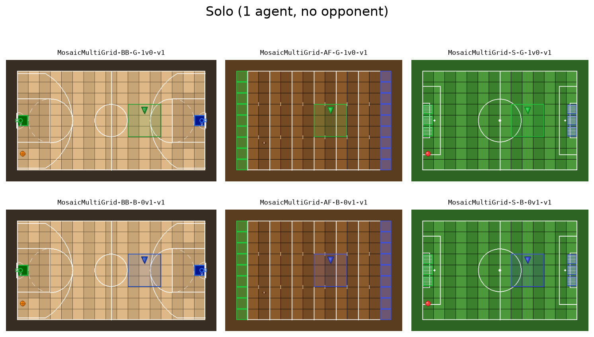
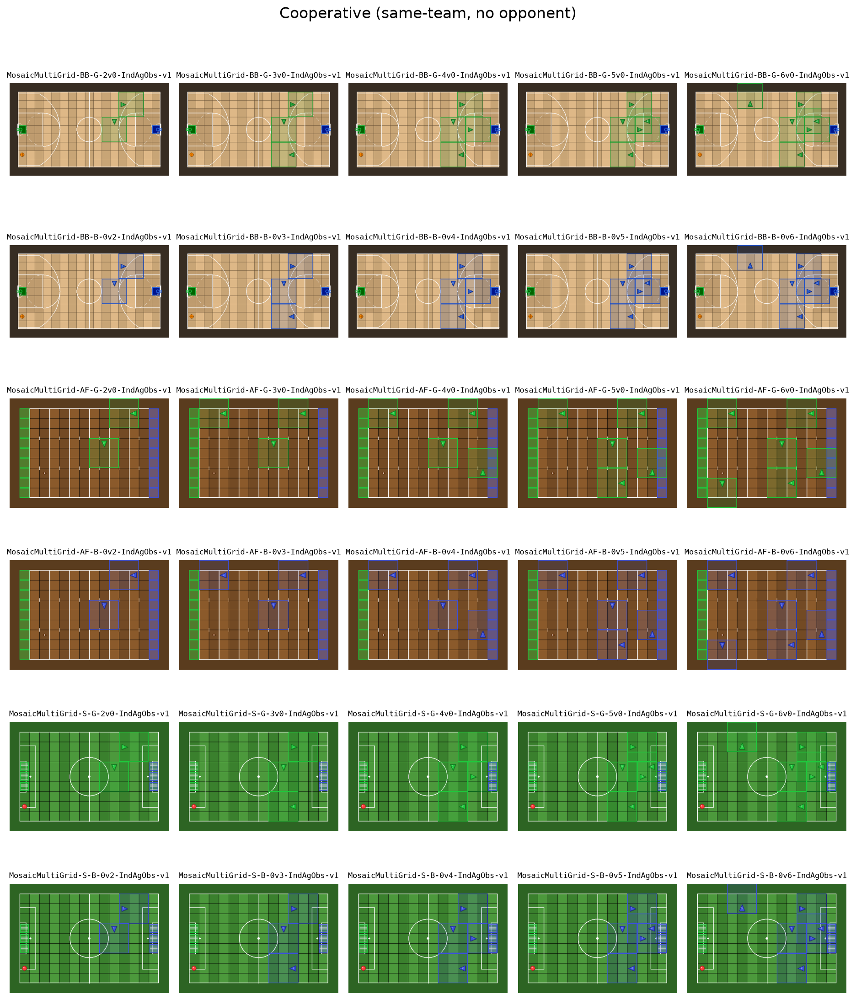
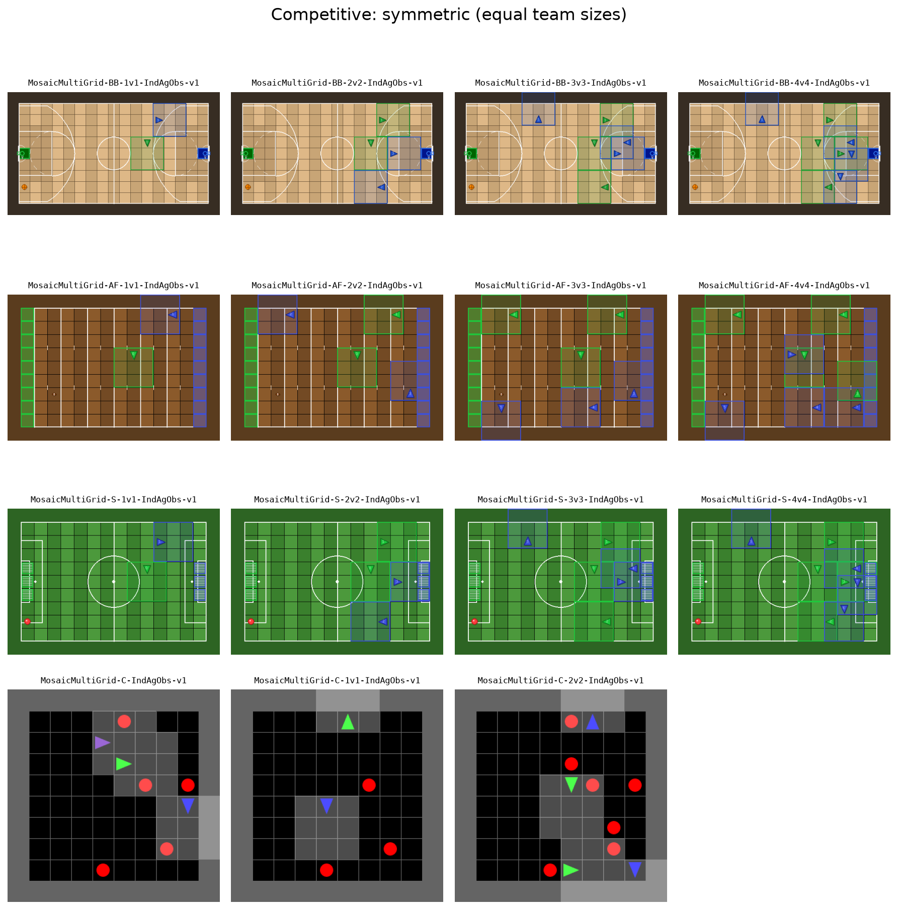
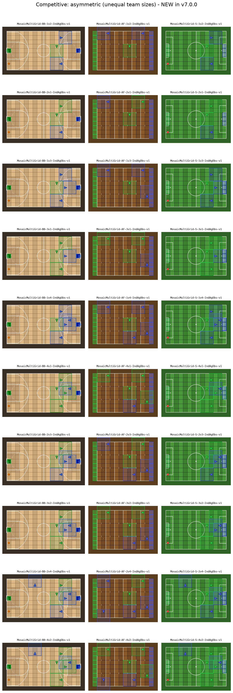

# Environments

81 environments registered with Gymnasium across four sport families:
Basketball (`BB`), American Football (`AF`), Soccer (`S`), Collect (`C`).

Load any environment with:

```python
import gymnasium as gym
import mosaic_multigrid.envs

env = gym.make("MosaicMultiGrid-BB-2v2-IndAgObs-v1")
```

## 1. Solo

Single agent, no opponent.



```
MosaicMultiGrid-BB-G-1v0-v1
MosaicMultiGrid-BB-B-0v1-v1
MosaicMultiGrid-AF-G-1v0-v1
MosaicMultiGrid-AF-B-0v1-v1
MosaicMultiGrid-S-G-1v0-v1
MosaicMultiGrid-S-B-0v1-v1
```

## 2. Cooperative

Same-team multi-agent, no opponent. Format is `G-Nv0` (Green cooperative)
or `B-0vN` (Blue cooperative).



```
MosaicMultiGrid-BB-G-2v0-IndAgObs-v1
MosaicMultiGrid-BB-G-3v0-IndAgObs-v1
MosaicMultiGrid-BB-G-4v0-IndAgObs-v1
MosaicMultiGrid-BB-G-5v0-IndAgObs-v1
MosaicMultiGrid-BB-G-6v0-IndAgObs-v1
MosaicMultiGrid-BB-B-0v2-IndAgObs-v1
MosaicMultiGrid-BB-B-0v3-IndAgObs-v1
MosaicMultiGrid-BB-B-0v4-IndAgObs-v1
MosaicMultiGrid-BB-B-0v5-IndAgObs-v1
MosaicMultiGrid-BB-B-0v6-IndAgObs-v1

MosaicMultiGrid-AF-G-2v0-IndAgObs-v1
MosaicMultiGrid-AF-G-3v0-IndAgObs-v1
MosaicMultiGrid-AF-G-4v0-IndAgObs-v1
MosaicMultiGrid-AF-G-5v0-IndAgObs-v1
MosaicMultiGrid-AF-G-6v0-IndAgObs-v1
MosaicMultiGrid-AF-B-0v2-IndAgObs-v1
MosaicMultiGrid-AF-B-0v3-IndAgObs-v1
MosaicMultiGrid-AF-B-0v4-IndAgObs-v1
MosaicMultiGrid-AF-B-0v5-IndAgObs-v1
MosaicMultiGrid-AF-B-0v6-IndAgObs-v1

MosaicMultiGrid-S-G-2v0-IndAgObs-v1
MosaicMultiGrid-S-G-3v0-IndAgObs-v1
MosaicMultiGrid-S-G-4v0-IndAgObs-v1
MosaicMultiGrid-S-G-5v0-IndAgObs-v1
MosaicMultiGrid-S-G-6v0-IndAgObs-v1
MosaicMultiGrid-S-B-0v2-IndAgObs-v1
MosaicMultiGrid-S-B-0v3-IndAgObs-v1
MosaicMultiGrid-S-B-0v4-IndAgObs-v1
MosaicMultiGrid-S-B-0v5-IndAgObs-v1
MosaicMultiGrid-S-B-0v6-IndAgObs-v1
```

## 3. Competitive (symmetric)

Equal team sizes.



```
MosaicMultiGrid-BB-1v1-IndAgObs-v1
MosaicMultiGrid-BB-2v2-IndAgObs-v1
MosaicMultiGrid-BB-3v3-IndAgObs-v1
MosaicMultiGrid-BB-4v4-IndAgObs-v1

MosaicMultiGrid-AF-1v1-IndAgObs-v1
MosaicMultiGrid-AF-2v2-IndAgObs-v1
MosaicMultiGrid-AF-3v3-IndAgObs-v1
MosaicMultiGrid-AF-4v4-IndAgObs-v1

MosaicMultiGrid-S-1v1-IndAgObs-v1
MosaicMultiGrid-S-2v2-IndAgObs-v1
MosaicMultiGrid-S-3v3-IndAgObs-v1
MosaicMultiGrid-S-4v4-IndAgObs-v1

MosaicMultiGrid-C-IndAgObs-v1
MosaicMultiGrid-C-1v1-IndAgObs-v1
MosaicMultiGrid-C-2v2-IndAgObs-v1
```

## 4. Competitive (asymmetric)

Unequal team sizes. New in v7.0.0.



```
MosaicMultiGrid-BB-1v2-IndAgObs-v1
MosaicMultiGrid-BB-2v1-IndAgObs-v1
MosaicMultiGrid-BB-1v3-IndAgObs-v1
MosaicMultiGrid-BB-3v1-IndAgObs-v1
MosaicMultiGrid-BB-1v4-IndAgObs-v1
MosaicMultiGrid-BB-4v1-IndAgObs-v1
MosaicMultiGrid-BB-2v3-IndAgObs-v1
MosaicMultiGrid-BB-3v2-IndAgObs-v1
MosaicMultiGrid-BB-2v4-IndAgObs-v1
MosaicMultiGrid-BB-4v2-IndAgObs-v1

MosaicMultiGrid-AF-1v2-IndAgObs-v1
MosaicMultiGrid-AF-2v1-IndAgObs-v1
MosaicMultiGrid-AF-1v3-IndAgObs-v1
MosaicMultiGrid-AF-3v1-IndAgObs-v1
MosaicMultiGrid-AF-1v4-IndAgObs-v1
MosaicMultiGrid-AF-4v1-IndAgObs-v1
MosaicMultiGrid-AF-2v3-IndAgObs-v1
MosaicMultiGrid-AF-3v2-IndAgObs-v1
MosaicMultiGrid-AF-2v4-IndAgObs-v1
MosaicMultiGrid-AF-4v2-IndAgObs-v1

MosaicMultiGrid-S-1v2-IndAgObs-v1
MosaicMultiGrid-S-2v1-IndAgObs-v1
MosaicMultiGrid-S-1v3-IndAgObs-v1
MosaicMultiGrid-S-3v1-IndAgObs-v1
MosaicMultiGrid-S-1v4-IndAgObs-v1
MosaicMultiGrid-S-4v1-IndAgObs-v1
MosaicMultiGrid-S-2v3-IndAgObs-v1
MosaicMultiGrid-S-3v2-IndAgObs-v1
MosaicMultiGrid-S-2v4-IndAgObs-v1
MosaicMultiGrid-S-4v2-IndAgObs-v1
```
